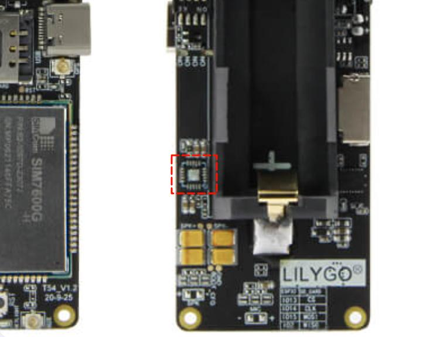
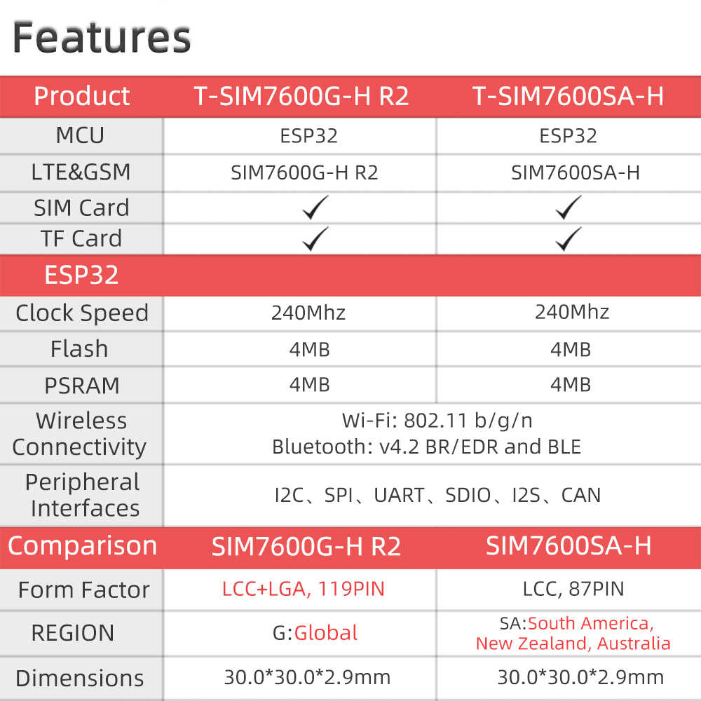
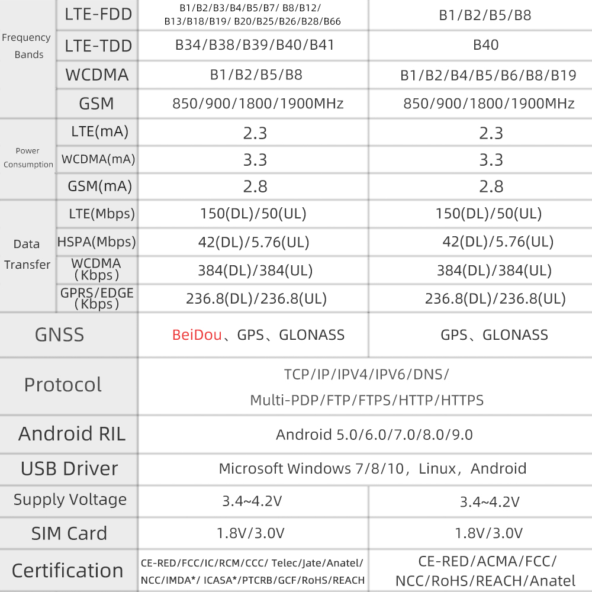
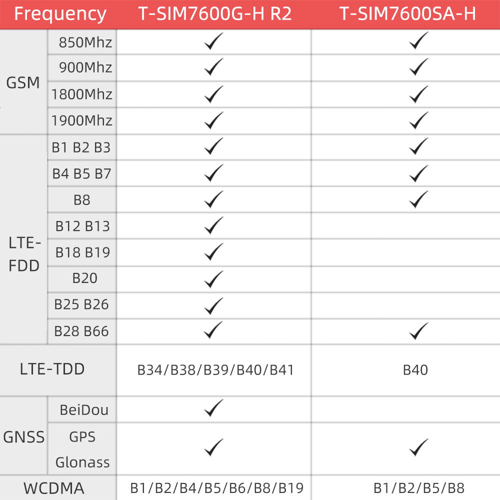

<h1 align = "center">🌟LilyGo SIM7600X🌟</h1>

<h2 align = "left">Product 📷:</h2>

# News

* For more complete and rich examples, please visit the new repository [LilyGO-T-A76XX](https://github.com/Xinyuan-LilyGO/LilyGO-T-A76XX)

|   Product   |                             Product  Link                             |                    Schematic                    | Status |
| :---------: | :-------------------------------------------------------------------: | :---------------------------------------------: | :----: |
| T -SIM7600X | [Product link](https://www.aliexpress.com/item/1005001705250713.html) | [Schematic](schematic/T54_SIM7600_20201012.pdf) |   ✅    |

## Use reference

|   Product   |                             Youtube  link                             |                  explanation                    | Status | 
| :---------: | :-------------------------------------------------------------------: |:-----------------------------------------------:| :----: |
| T -SIM7600X | [Youtube link](https://www.youtube.com/watch?v=ohgLGYYOW74) |    How to use the SIM7600X board     |   ✅    |
| LilyGo device | [Youtube link](https://www.youtube.com/watch?v=f3BybP3L7ls) |    How to enter boot mode to download the firmware     |   ✅    |

## Notes for new Users

1. pin **VBUS** is a USB input, if a battery is being used to power the device there will be no voltage output from VIN meaning 3.3v is the only power output.

2. When using the built-in battery pack the on/off switch will function as normal, supplying/cutting off power to the board, However, if an external battery pack is used and attached to the VBAT pin the on/off switch will be bypassed meaning the only way to shut off will be to disconnect the batteries.

3. On/off switch is for battery use only, it will not function when plugged into USB.

4. Battery voltage can not be read when plugged into USB using the onboard BAT ADC(35) 

5. Recommended solar panels are 4.4v to 6v **DO NOT EXCEED OR BOARD MAY BE DAMAGED** 

6. When an SD card in you can not upload software in Arduino IDE since the SD card uses IO2 as MISO, the SD card must be removed when uploading a new sketch.

7. If you need to use an external power adapter to power the SIM7600, you can connect the DC positive pole to the board **VBUS** Pin. The maximum input voltage is 5V. Do not exceed this voltage, otherwise the original circuit board will be burned.

8. There are two Type-C interfaces on the board, which are ESP32 download port and modem USB. On the back of the board, there are four switches for selection.
    1. When using ESP32 programming, select as shown below
    

    2. When using a modem to connect a computer to the Internet, select as shown below[Click here for connection method](docs/pc/README.MD)
    

9. If you need to make a voice call, you need to buy a SIM7600G with an audio decoder. You can check the red box in the figure below. If there is no chip here, there is no decoder version and the voice call function cannot be used.

    1. The figure below shows a version without a decoder. If there is a chip here, you can solder the microphone to the MIC+ and MIC- pads and the speaker to the SPK pad.
    
10. The SIM7600G solar charging chip has been updated to CN3165. The schematic diagram remains unchanged, but the CN3065 has been changed to CN3165. The input range is also 4.4V ~ 6V input voltage. The maximum USB/solar charging current is 500mA. The solar input power is not limited. It is recommended to use a 5V input solar panel, which cannot exceed 6V input voltage.

## Features

